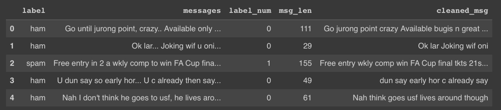
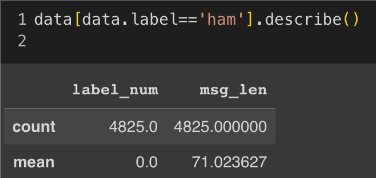
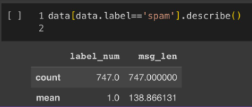
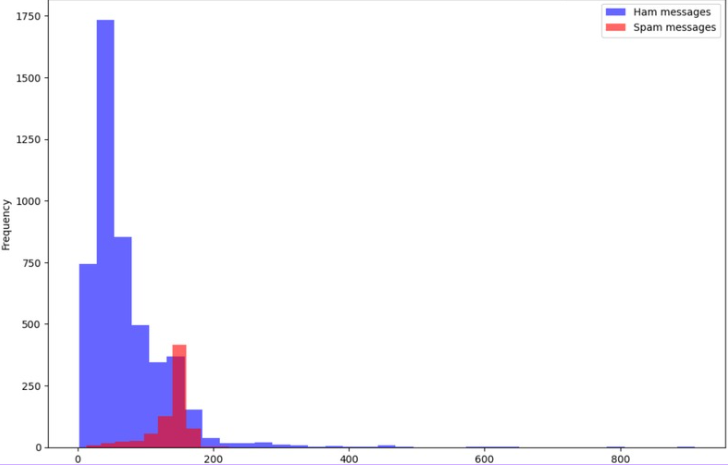
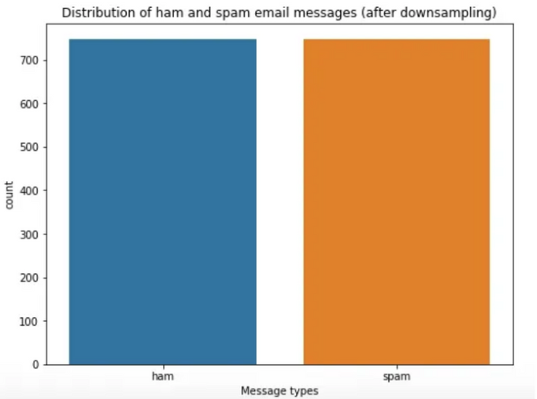
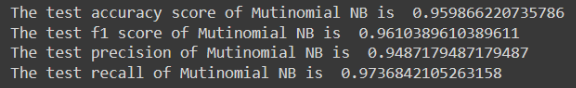
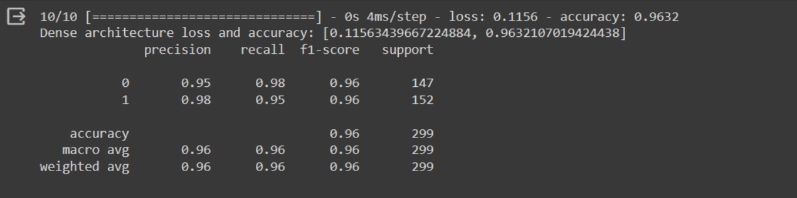

# Project Name: NLP SMS Spam Detection 

This is a group project done for the Human Computer Interaction Module, we use Multinomial Naive Bayes and Dense as the algorithms.

## Introduction

- Over the last year, Americans received more than 400 million spam texts per day
- 68.4 million Americans fell victim to a phone scam. (2022)
- Scam texts cost Americans over $326 million. (2022)

## The dataset: SMS Spam Collection Dataset

This dataset is a set of SMS tagged massages that has been collected for SMS spam research. It contains over 5000 massages, all in english tagged either ham (legitimate) or spam. 

retrieved from: https://www.kaggle.com/datasets/uciml/sms-spam-collection-dataset/data

Dataset Example:

## Exploratory Data Analysis
Data with Ham (Legitimate Messages) and Spam:

Chart:

## Data Cleaning
Data Cleaning Steps:

1. Remove Stopwords
2. Remove Punctuations
3. Downsampling

Data After downsampling:

## Results:
Multinomial Naive Bayes:

Dense Result:
- Epoch: 50
- n_dense: 24
- Adam Optimizer
- Early Stopping: 3

## Conclusion

Accuracy Results
- Multinomial Naive Bayes: 95%
- Dense: 96%

The two models which are Multinomial Naive Bayes and Dense has good performance in spam detection with both accuracy of over 95%. Therefore, both models can be used for real life practices. To do so, further develompent needs to be done so that these algorithms can integrate with the phones SMS service.

Things that could be improved: 
We can try different hyper parameters,  such as increasing the sample size to improve the model.
